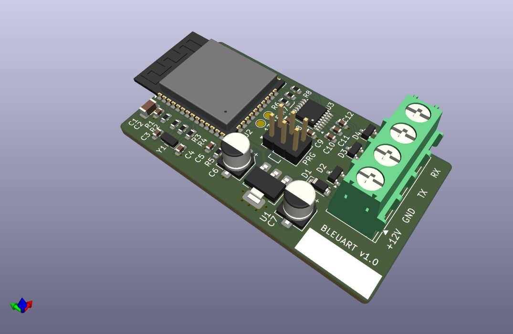

# bleuart

ESP32 BLE to RS232 bridge

	BLE  <->  UART  <-- RX (RS232)
	                --> TX (RS232)

Provides a low-tech RS232 UART via BLE
write and notify under a single custom GATT service
with ID 11e6b0a4-99c7-4647-956b-8a57cb5907d9.

Advertises device "location" (CNAME) via
manufacturer data. Initial bonding PIN is 0.

## Characteristics

UUID | Function | Type | Actions
--- | --- | --- | ---
0000b0a4-99c7-4647-956b-8a57cb5907d9 | Pin | uint32 (0-999999) | write
0001b0a4-99c7-4647-956b-8a57cb5907d9 | UART RX | bytes | read/notify
0010b0a4-99c7-4647-956b-8a57cb5907d9 | UART TX | bytes | write
0100b0a4-99c7-4647-956b-8a57cb5907d9 | CNAME "Location" | bytes | read/write
1000b0a4-99c7-4647-956b-8a57cb5907d9 | DNAME "Device Name" | bytes | write
f074b0a4-99c7-4647-956b-8a57cb5907d9 | FOTA | bytes | write
0x2a26 | Firmware Version | bytes | read

## Known Issues/Limitations

   - LE security is circumvented by use of fixed pairing pin. Todo: OOB.
   - Private addrs do not yet work as expected. Todo: Investigate 
     implementation of RPA 0x2ac9.
   - RS232 line driver/receiver is always on, even when device cannot
     receive data due to light sleep. Todo: Use GPIO to switch power
     to line driver.
   - Nimble stack occasionally flakes out, suspect crystal/timer
     or memory issue.
   - Test pads GPIO13/15 are inaccessible and floating. Todo:
     Add pull-ups and relocate pads with nearby ground pad for
     factory reset option.
   - Reflashable plain text bootloader assumed. Todo: Investigate
     encrypted flash, encrypted OTA transport.
   - App rollback not supported. Todo: Debug OTA partition
     errors in bootloader and check ota rollback tools.
   - Serial data stream naively communicated by GATT characteristics,
     it is assumed that connected devices will manage stream
     only when connected. Todo: investigate BLE service 0x1101.

## FOTA

Write SSID and PSK to GATT characteristic 0xf074 separated
by a null character. Eg:

	b'SSID\0wpapskstr'

Device will connect to nominated ssid, fetch firmware 
then reboot. Base URL for update is set in menuconfig
options. In case of error or timeout, device will reboot to
previous firmware.

Update file requested:

	11e6b0a4-99c7-4647-956b-8a57cb5907d9.bin

## Build & Flash

   - Install ESP-IDF & run export
   - Set target
   - Create secure boot signing key if required
   - Run burnin.sh

	$ . ../esp-idf/export.sh
	$ idf.py set-target esp32
	$ idf.py secure-generate-signing-key secure_boot_signing_key.pem
	$ ./burnin.sh
